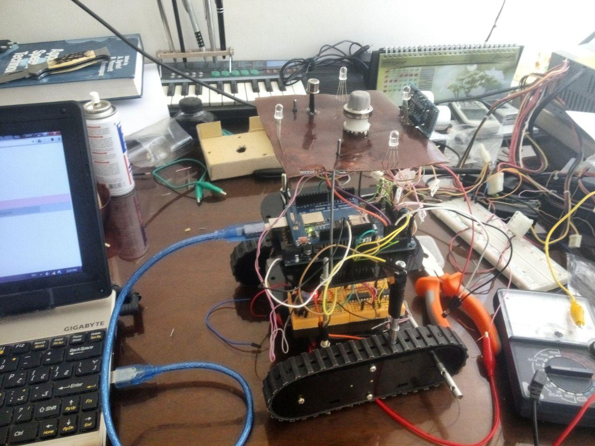

# webBased-arduino-controller

This is the code that I wrote for a robotic project in 2015. The project included building a prototype  robot which was controlled by arduino board. 
Users can control the robot by through web based interface by his browser (PC, phone, tablet …) , in this way teach the robot paths it should traverse. The robot saves those paths and save them in text files on a microSD card.

All communications is done through a WIFI network, therefor the robot and the user interface device (say his  smart-phone ) must be connected to a same network.
When the robot traverse the pre-saved paths, at same time it reports its sensors (including gas detectors , temperature and humidity). If it detects a gas leakage based on the data it has received from it sensors it stops there and sends alarms (Audio alaram, blinking LEDs and of course to through its web interface)

there are 2 server programs for this robot the first one is:
## server.ino
this is a program to work with a step motor robot and another program :
## DCServer.ino
to work with a robot with DC motor. The later is more complete.

Servers codes are a little messy but I think many parts of them are still reusable.

